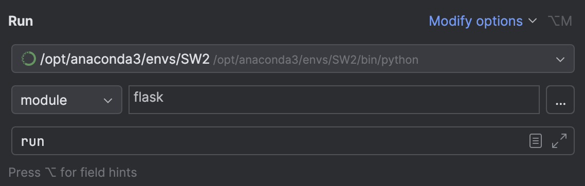

# Mix and Match

## Project Overview

**Mix and Match** is system designed for first-year students, with a focus on international students who often arrive on campus alone, without existing friendships or family support. The main purpose of the app is to bring these students together and facilitate new friendships by generating groups from registered Students and assigning them collective tasks and on-campus activities.

The system is split into two components (Mix&Match Admin and Mix&Match Android App) and features 3 user types: Students, Mentors (Senior student volunteers) and Admins. Admins are meant to solely use the Mix&Match Admin, while Students and Mentors only use the Mix&Match Android App. The only exception is: Students must use the Mix&Match Admin Backend for initial registration (only once).

This documentation focuses on Mix&Match Admin, which is primarily meant for Admin users. To access the Mix&Match Android App's documentation, please visit https://github.com/Logeshsharma/bus-assignment2-moibleapp-prototype.git

---


## Step-by-step instructions on how to run the project

**Requirements:** - Python 3.12.8 and conda 25.1.0

**Steps:**  
1. Unzip and Open the Project:  Extract the downloaded ZIP file. Open the extracted folder in PyCharm. 
2. Install Dependencies: Open the terminal in PyCharm. Run the following command to install required packages:
```pip install -r requirements.txt```
3. Configure Flask Run Settings in PyCharm - Go to Run > Edit Configurations - follow the screenshot instructions



4. Initialize the Database - In the terminal, enter the - flask shell
5. Run the command to create and populate the database - reset_db()
6. Start the application by running the configuration you created.
7. The app will be available at: http://127.0.0.1:5000
8. Use admin of the test users defined in debug_utils.py to log in.


### Disclaimer: The current implementation of the Mix&Match Android will not connect to the local version of the Mix&Match Admin application at http://127.0.0.1:5000. Instead, it's hardcoded to connect to https://bus-test-f592.onrender.com running on a free server (allow up to a minute to load for the first time). Therefore, if you wish to test whether the changes in Mix&Match Admin's database reflect in the Android App, please test these changes at the onrender.com server address provided. Bear in mind that the server/db resets after approx 15 minutes of inactivity.


## Languages and Frameworks Used

- **Programming Languages:** Python, HTML, CSS
- **Frameworks:** Flask, Flask-SQLAlchemy, Flask-Login, Flask-WTF, SQLAlchemy, Jinja2, Bootstrap 5.0
- **Development Tools:** PyCharm, Visual Studio Cod 
- **Target Platforms:** Windows, macOS
- **Database:** SQLite

---

## Core functionalities

- **Student Registration:** Allows unregistered Students to validate their identity and register in the system by comparing a combination of username and student_id to the 1-st year student database (mock database used for prototype). Once the student is registered, their "registered" field value is changed to True in "users" table, and they become eligible for Group Generation and using the Android App.
- **Group formation:** Gives admin users a button that assigns all non-grouped students into groups of 4 along with a 1 mentor (total 5), given enough students and mentors are available. Group is created in the database "groups" table and stores the names of all Students/Mentors in the group, as well as the group's progression status for every task "groupTaskStatuses".
- **Group task creation:** Admins can create tasks in the Mix&Match Admin through a form on the /create_task page. Tasks are then recorded into the database "tasks" table, and assigned to every existing group with each group's own task status being tracked in "groupTaskStatuses" table by using combination of task and group foreign keys.  
- **Task completion/validation** Students can mark the group task statuses as completed. Mentors can then validate the completion tasks in the app. All changes reflected in database's "groupTaskStatuses" table.
  - **Note:** A significant part of this functionality is implemented in the Android Mix&Match App, as Mentors and Students are meant to primarily use it. For more details about this functionality and implementation please refer to the Mix&Match Android App's documentation or view the source code at: https://github.com/Logeshsharma/bus-assignment2-moibleapp-prototype.git  


## Secondary/Supporting functionalities
- **User Authentication/Login:** Admins can log in to Mix&Match Admin with their credentials. Custom error messages are displayed if a Student/Mentor tries to log into the Mix&Match Admin.
- **User Logout:** Logs the current User out of the app.
- **Home Page:** Serves as a portal to access group and task features.
- **View Tasks:** Displays an overview of existing tasks in the system as a table.
- **Task Details:** Given a task id, displays a particular task's details including Task id, Description, Upload required status, and every group's completion status for that task as a table.
- **View Tasks:** Displays an overview of existing tasks in the system as a table.
- **Admin Account Panel:** Displays an overview of each User's details in the system including User Name, User SID, User Email, User Role, User Registration Status, Group ID as a table. Also the logged in Admin's Name, Account ID, and email address.
- **View All Groups:** Displays and overview of all groups in the system, including Group id, Student names and Mentor names as a table. Total number of groups displayed.
- **Communication with Android Mix&Match App:** The Mix&Match Admin features multiple web API addresses which are used to communicate with the Mix&Match Android App through json files they are:
  - **Mobile Login:** Upon receiving a json with username and password, authenticates their combination in the db and if successful, sends back json with result message, status and user's details, else returns a json with appropriate json message and erros status.
  - **Get group information:** /get_group_mobile/\<int:group_id> if a group with this id exists, returns all of its ids and users from the db's "groups" table as a json, else returns json {'id': -1}
  - **Get group's tasks:** /get_tasks_mobile/\<int:group_id> if a group with this id exists, returns all of its tasks' details as well as the group's task completion status as a json, else returns json {'tasks': []}
  - **Get group's messages:** /get_group_messages/\<int:group_id>/\<int:number_of_messages> if a group exists returns up to last 'number_of_messages' details of that group as a json, else returns {'message_id': -1}
    - The original version of the app envisioned messaging and task rewards functionality within each group, however, it was cut from the prototype due to time limitations. The messaging API remains.
  - **Get group task status:** Upon receiving a json with group id, task id and status, queries the db and ia group with this task id exists, updates the task's status value to the one provided in json, then returns {'status': 'Updated to the request sender'}, else returns {'status': 'failed'} to the sender.
---

## Contributors

- Arseniy Vasilko (2072309)  
- Charlotte Ashmore (2897025)  
- Gurjeevan Pannu (2897368)  
- Logesh Sharma Kalimuthan (2845496)  
- Mashrur Hossain Chowdhury Ritom (2867717)

*Each member contributed equally (20%).*